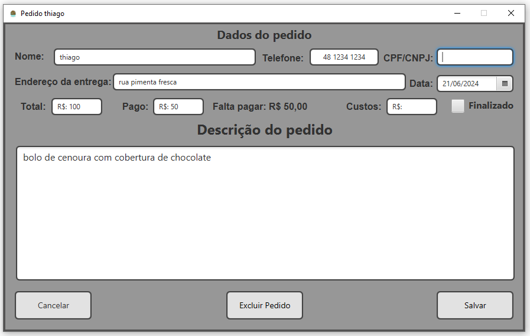
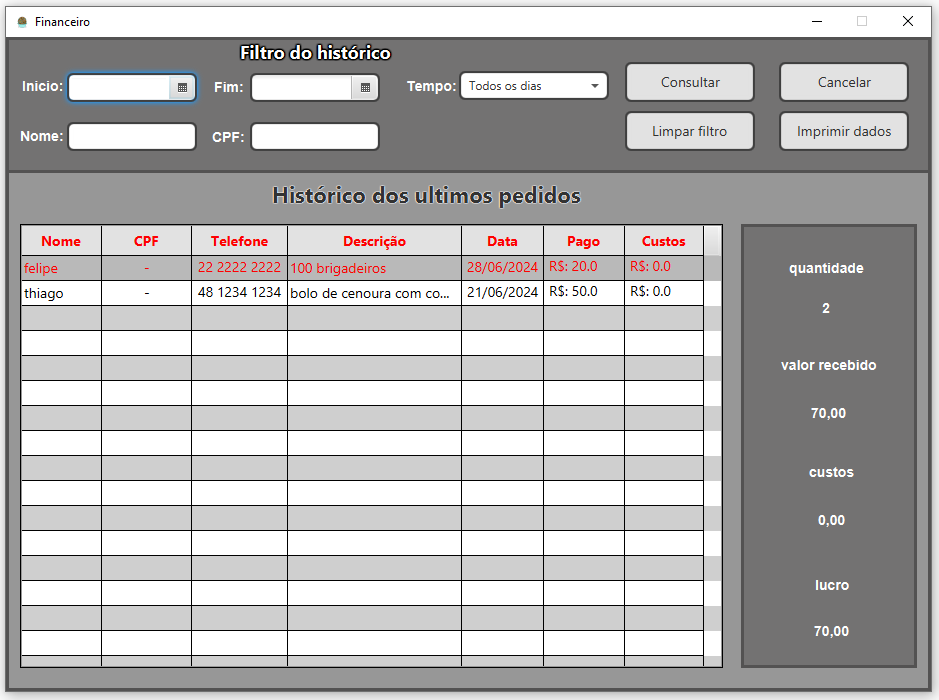

# ProjetoExtensao
# SOFTWARE DE GESTÂO DE PREZOS

## Índice
1. [Descrição do projeto](#Descrição_projeto)
2. [Requisitos Funcionais](#Funcionalidades)
3. [Imagens](#imagens_projeto)
4. [Instalação para uso](#Instalação-uso)
5. [Instalação para modificação](#instalação-codigo-fonte)
6. [Relato pessoal](#relato_pessoal)
7. [ideias de melhorias](#melhorias?)
8. [Contribuição pessoal](#Contribuição)

## Descrição_projeto
O aplicativo foi desenvolvido por estudantes universitários de cursos relacionados à Tecnologia da Informação (TI), e visa facilitar a administração e o controle de pedidos para um microempreendedor individual (MEI).

	1- Centralização de Pedidos
Consolidar todos os pedidos em um único lugar, independentemente da plataforma de venda (iFood, WhatsApp, etc.), 
para facilitar o gerenciamento e a visualização.

	2- Ordenação de Pedidos por Data de Entrega

	3- organização de tarefas menores
o aplicativo tem uma funcionalidade para anotar pequenas tarefas menores que devem ser feitas durante a semana como preparar embalagens, comprar ingredientes, fazer publicidade

	4- Geração de Estatísticas e Relatórios
Produzir relatórios financeiros detalhados, incluindo receitas, custos e lucros, proporcionando uma visão clara das finanças, também a possibilidade de ver o volume de vendas mensais

## funcionalidades
1. Cadastro de pedidos (feito) 
2. Visualização dos pedidos (feito) 
3. Mostrar os pedidos em ordem de entrega (LISTA DE PEDIDOS) (feito) 
4. Pesquisa sobre os pedidos abertos por CPF, NOME ou DATA ENTREGA (PESQUISA DOS PEDIDOS) (feito) 
5. Estatísticas da empresa filtrada por tempo (dia, semana, mês...) (feito)

    	5.1 Receita (feito)
      	5.2 Custo operacional (feito) 
    	5.3 Lucro (feito) 
    	5.4 Quantidade de pedidos (feito) 
    	5.5 Impressão das estatísticas (feito) 
    	5.6 Salvar os dados ou enviar por Email (não feito devido à complexidade e pq seria a única coisa do programa que precisaria de conexão com a internet) 
7. Histórico dos pedidos (feito) 
8. Pesquisa no histórico dos pedidos por CPF, NOME ou DATA ENTREGA (PESQUISA DOS PEDIDOS) (feito) 
9. Task list da semana basicamente um espaço para poder anotar tarefas pequenas a serem feitas na semana (feito) 
10. Notificação sobre os pedidos (também envolveria a internet e é simples ver os pedidos que estão chegando perto do prazo) 
11. forma de imprimir um resumo do pedido (removido, pois a cliente não precisa e não tem impressora) 

## imagens_projeto
Menu onde mostra a tabela de pedidos em cima e em baixo a parte de anotações  
Pedido aberto é a mesma janela da ciração de pedido  
Financeiro é onde fica o histórico de pedidos e por onde é possível gerar o relatório em Excel 

## Instalação-uso
Para instalar o aplicativo:

1. Baixe a pasta "instalacao" do repositório do github:
    link: https://github.com/Thiago-Weiss/Projeto-Extensao

2. configurar o banco de dados
    intale o postgresql
    link: https://www.postgresql.org/download/
    2.1 coloque a senha dele coloque como: 2015
    2.2 crie um novo banco de dados com o nome de: confeitariaBD
    2.1 use o arquivo "banco_dados.sql" criar as estruturas de pasta do banco

3. instale o java
    link: https://www.oracle.com/br/java/technologies/downloads/
    recomendo o 21

4. instalar o app
    4.1 copie a pasta "App" para onde vc quiser que o aplicativo fique no seu computador
    4.2 para abrir o app é só clicar no iniciar.bat
    4.3 se quiser colocar o icon do brigadeiro na pasta do programa
        4.3 botão direito na pasta "App" -> propriedades -> personalizar -> alterar ícone -> selecione o ícone (ele está dentro da pasta "bibliotecas")

## Instalação-codigo-fonte
1. baixe a pasta "codigo-fonte" do repositório do github
    link: https://github.com/Thiago-Weiss/Projeto-Extensao
    
2. configure o seu ambiente de desenvolvimento
    2.1 intale o postgresql
    link: https://www.postgresql.org/download/
        2.1.1 use o arquivo "banco_dados.sql" para criar o banco de dados
        2.1.2 no arquivo MainStart.java do "src" modifique os dados do servidor como senha e o nome do banco

    2.2 o código fonte é a pasta "src" coloque ele na sua IDE

    2.3 instale as biblioteca e configure elas na sua IDE
        2.3.1 javaFX 21
        2.3.2 jxl
        2.3.3 bibliotec de conexao com o bd

## melhorias?
São ideias que não vi necessidade de colocar por questões de não necessitar ou falta de conhecimento, mas por um projeto mais "bonito" seria legal telas
1. fazer um arquivo externo com as configs de login do banco de dados
2. fazer ele abrir sem o CMD ficar aberto
    Para abrir o app agora tem que usar um .bat que passa o class_path da biblioteca javaFX e com isso o console fica aberto de fundo
2.1 transformar ele em um installer completo
    fazer ele instalar tudo o que ele precisa sozinho como o java e o banco de dados
2.2 transformar ele em um app pra funcionar em uma micro empresa com vários computadores podendo rodar ele simultaneamente
3. melhorar o layout geral do app, deixar ele mais "bonito"

## Contribuição
1- Contato com a Cliente:
Entender o problema da cliente através de reuniões e conversas.
Desenvolver a solução com a participação da cliente, mantendo-a informada sobre o progresso do projeto.
Entregar o aplicativo final e fornecer treinamento sobre seu uso.

2- Organização do Cronograma:
Planejar e organizar as atividades e prazos do projeto utilizando ferramentas como o Trello para gerenciar tarefas e acompanhar o progresso.

3- Modelagem UML:
Modelar os requisitos funcionais e não funcionais do aplicativo.

4- Desenvolvimento do Software:
Desenvolvi tudo.
        
