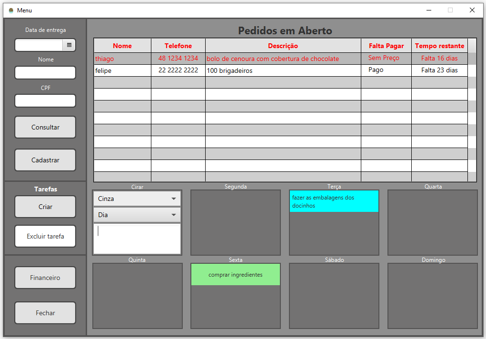
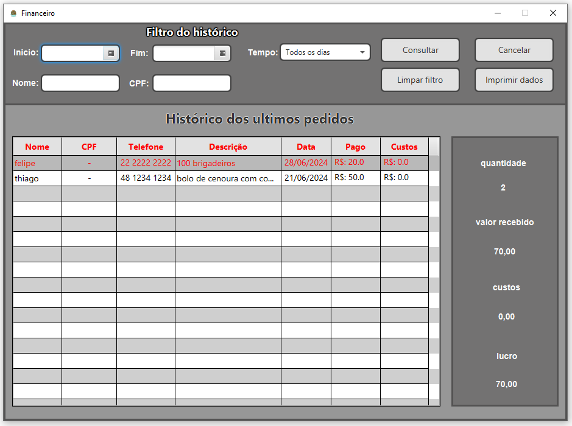

# ProjetoExtensao
# SOFTWARE DE GESTÂO DE PREZOS

## Índice
1. [Descrição do projeto](#Descrição_projeto)
2. [requisitos funcionais](#Funcionalidades)
3. [Imagens](#imagens_projeto)
4. [Instalação para uso](#Instalação-uso)
5. [Instalação para modificação](#instalação-codigo-fonte)
6. [Relato pessoal](#relato_pessoal)
7. [ideias de melhorias](#melhorias?)
8. [Contribuição pessoal](#conrtibuicao)
9. [relato pessoal](#relato_pessoal)

## Descrição_projeto
O aplicativo foi desenvolvido por estudantes universitários de cursos relacionados à Tecnologia da Informação (TI), e visa facilitar a administração e o controle de pedidos para um microempreendedor individual (MEI).

	1- Centralização de Pedidos
Consolidar todos os pedidos em um único lugar, independentemente da plataforma de venda (iFood, WhatsApp, etc.), 
para facilitar o gerenciamento e a visualização.

2- Ordenação de Pedidos por Data de Entrega

3- organização de tarefas menores
o aplicativo tem uma funcionalidade para anotar pequenas tarefas menores que devem ser feitas durante a semana como preparar embalagens, comprar ingredientes, fazer publicidade

4- Geração de Estatísticas e Relatórios
Produzir relatórios financeiros detalhados, incluindo receitas, custos e lucros, proporcionando uma visão clara das finanças, também a possibilidade de ver o volume de vendas mensais

## funcionalidades
1. Cadastro de pedidos (feito) 
2. Visualização dos pedidos (feito) 
3. Mostrar os pedidos em ordem de entrega (LISTA DE PEDIDOS) (feito) 
4. Pesquisa sobre os pedidos abertos por CPF, NOME ou DATA ENTREGA (PESQUISA DOS PEDIDOS) (feito) 
5. Estatísticas da empresa filtrada por tempo (dia, semana, mês...) (feito) 
    5.1 Receita (feito) 
    5.2 Custo operacional (feito) 
    5.3 Lucro (feito) 
    5.4 Quantidade de pedidos (feito) 
    5.5 Impressão das estatísticas (feito) 
    5.6 Salvar os dados ou enviar por Email (não feito devido à complexidade e pq seria a única coisa do programa que precisaria de conexão com a internet) 
6. Histórico dos pedidos (feito) 
7. Pesquisa no histórico dos pedidos por CPF, NOME ou DATA ENTREGA (PESQUISA DOS PEDIDOS) (feito) 
8. Task list da semana basicamente um espaço para poder anotar tarefas pequenas a serem feitas na semana (feito) 
9. Notificação sobre os pedidos (também envolveria a internet e é simples ver os pedidos que estão chegando perto do prazo) 
10. forma de imprimir um resumo do pedido (removido, pois a cliente não precisa e não tem impressora) 

## imagens_projeto
Menu onde mostra a tabela de pedidos em cima e em baixo a parte de anotações  
Pedido aberto é a mesma janela da ciração de pedido  
Financeiro é onde fica o histórico de pedidos e por onde é possível gerar o relatório em Excel 

## Instalação-uso
Para instalar o aplicativo:

1. Baixe a pasta "instalacao" do repositório do github:
    link: https://github.com/Thiago-Weiss/Projeto-Extensao

2. configurar o banco de dados
    intale o postgresql
    link: https://www.postgresql.org/download/
    2.1 coloque a senha dele coloque como: 2015
    2.2 crie um novo banco de dados com o nome de: confeitariaBD
    2.1 use o arquivo "banco_dados.sql" criar as estruturas de pasta do banco

3. instale o java
    link: https://www.oracle.com/br/java/technologies/downloads/
    recomendo o 21

4. instalar o app
    4.1 copie a pasta "App" para onde vc quiser que o aplicativo fique no seu computador
    4.2 para abrir o app é só clicar no iniciar.bat
    4.3 se quiser colocar o icon  do brigadeiro na pasta do programa
        4.3 botão direito na pasta "App" -> propriedades -> personalizar -> alterar ícone -> selecione o ícone (ele está dentro da pasta "bibliotecas")

## Instalação-codigo-fonte
1. baixe a pasta "codigo-fonte" do repositório do github
    link: https://github.com/Thiago-Weiss/Projeto-Extensao
    
2. configure o seu ambiente de desenvolvimento
    2.1 intale o postgresql
    link: https://www.postgresql.org/download/
        2.1.1 use o arquivo "banco_dados.sql" para criar o banco de dados
        2.1.2 no arquivo MainStart.java do "src" modifique os dados do servidor como senha e o nome do banco

    2.2 o código fonte é a pasta "src" coloque ele na sua IDE

    2.3 instale as bilbiotecas e configure elas na sua IDE
        2.3.1 javaFX 21
        2.3.2 jxl
        2.3.3 bibliotec de conexao com o bd

    2.4 feito

## melhorias?
São ideias que não vi necessidade de colocar por questões de não necessitar ou falta de conhecimento, mas por um projeto mais "bonito" seria legal telas
1. fazer um arquivo externo com as configs de login do banco de dados
2. fazer ele abrir sem o CMD ficar aberto
    Para abrir o app agora tem que usar um .bat que passa o class_path da biblioteca javaFX e com isso o console fica aberto de fundo
2.1 transformar ele em um installer completo
    fazer ele instalar tudo o que ele precisa sozinho como o java e o banco de dados
2.2 transformar ele em um app pra funcionar em uma micro empresa com vários computadores podendo rodar ele simultaneamente
3. melhorar o layout geral do app, deixar ele mais "bonito"

## Conrtibuicao
1- Contato com a Cliente:
Entender o problema da cliente através de reuniões e conversas.
Desenvolver a solução com a participação da cliente, mantendo-a informada sobre o progresso do projeto.
Entregar o aplicativo final e fornecer treinamento sobre seu uso.

2- Organização do Cronograma:
Planejar e organizar as atividades e prazos do projeto utilizando ferramentas como o Trello para gerenciar tarefas e acompanhar o progresso.

3- Modelagem UML:
Modelar os requisitos funcionais e não funcionais do aplicativo.

4- Desenvolvimento do Software:
Desenvolvi tudo [aqui está o explicativo](#relato_pessoal)
        

## Relato_pessoal
Para poder entender o meu relato eu primeiro tenho que explicar como foi o projeto de extensão e o que é
Este projeto foi desenvolvido como parte de uma disciplina do semestre que representava a nota final. O grupo era composto por cinco integrantes, incluindo eu e mais quatro colegas e o projeto foi dividido em três grandes partes:

Observação: Este foi meu primeiro contato com Java e meu primeiro uso real com banco de dados. A única bagagem útil que eu tinha era a Programação Orientada a Objetos (POO) em Python e a interface gráfica Tkinter do Python.

1. Achar uma cliente e identificar uma problemática dela e defender a ideia do projeto em uma apresentação:
    1 Semana - tarefa do grupo: achar uma possível cliente.
        Fui o único que apresentou uma opção e ele foi aceita por todos
    2 Semana - tarefa do grupo: elaborar questões para a cliente para mapearmos a problemática.
        De 9 questões que elaboramos, 5 eram minhas
    2 a 4 semana - tarefa do grupo: começar a responder às questões (10 questões ao total) da primeira defesa do projeto e preparar a primeira apresentação.
        De 10 questões respondi 6 sozinhas e ajudei MUITO nas outras 4 questões e também comecei a organizar o Trello para essa apresentação
        obs.: aqui um colega fez algo muito legal e foi elogiado pelo professor que foi juntar as respostas que estavam em texto e fazer um PowerPoint para apresentação
        obs.: a apresentação foi de 15 min apresentada pelos meus colegas, eu só respondi às perguntas do professor 

2. Planejamento Detalhado e Início do Desenvolvimento:
    3 a 8 semana - tarefa do grupo: estudar o java, javafx, banco de dados... para podermos desenvolver o aplicativo.
        Continuei a organizar o Trello e dividi o grupo em interface 2 colegas, banco de dados 2 colegas e integração eu, mas eu continuei a estudar o java e o javafx porque eu estava modelando interfaces e modelos UML (classes e fluxogramas) para apresentar para a cliente, aqui eu tive dois aprendizados, primeiro não mande coisas fora de horário comercial (aprendi isso porque mandei algo fora do horário e não foi agradável para a cliente) e o segundo se for apresentar algo vale mais a pena apresentar algo no Paint desenhando na hora do que um fluxograma bem feito (as imagens dos manuais de instruções são mais uteis que os textos deles) e foi nesse período que entendi o que significava "trabalho em grupo da faculdade", basicamente eu perguntava uma vez por semana como estava e só enrolavam e não desenvolviam nada, no Trello não completavam as tarefas deles...
    8 a 9 semana - tarefa: fazer a segunda apresentação com o começo do desenvolvimento, as modelagens e o que mais tiver.
        Apresentei sozinho porque ninguém tinha feito nada
        
3. Desenvolvimento e Entrega:
    10 a 14 semana - tarefa: desenvolver o aplicativo.
        Tentei ajudar os colegas para fazerem suas partes, mas não obtive sucesso, basicamente me enrolaram, enquanto isso continuei aprendendo mais e comecei a desenvolver
        obs.: o colega do PowerPoint fez a base do banco de dados, que era basicamente duas tabelas meio "erradas" (tive que refazer uma parte) e sem começão com o java, então tive que começar a ver sobre banco de dados e como conectar com java
    14 a 18 semana - tarefa: desenvolver o aplicativo.
        Desisti dos colegas e desenvolvi tudo sozinho e acabei
        obs.: foi um mês de pura irritação pessoal e pensamentos de dedurar para o professor, mas acabei não fazendo porque não tinha nada a ganhar e só a perder fazendo inimizades
    18 a 20 semana - tarefa: entrega do app treinamento e defessa do projeto.
        Estou nessa parte agora, estou fazendo a entrega do app para a cliente e ajudando na defessa

Resumo do que eu aprendi:
Conhecimento técnico: Aprendi uma base solida do java e da biblioteca javaFX, aprofundei o paradigma do POO e aprofundei o conhecimento geral sobre banco de dados, entre outros.
Conhecimento geral: O conceito do que significa "Projeto em grupo da faculdade" ou "O trauma do projeto em grupo na faculdade" e também sobre como conversar com o cliente de uma forma mais "fácil".

